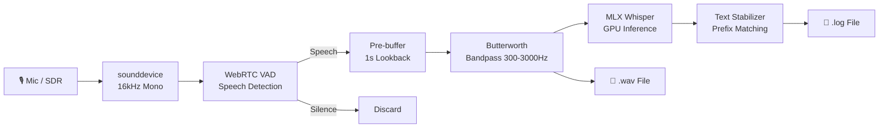
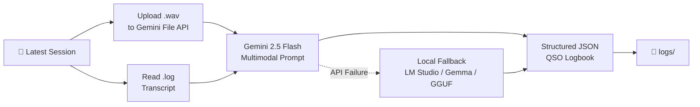

<div align="center">

# 📡 Project Zankar

### *The Vibrations of Desire*

**Real-time HAM radio transcription & intelligent logbook generation,
powered by Apple Silicon GPU acceleration and Google Gemini.**

[](https://python.org)
[](https://github.com/ml-explore/mlx)
[](https://ai.google.dev/)
[](LICENSE)
[](CONTRIBUTING.md)

---

*"Zankar" (ज़ंकार) — the resonant vibration of a struck string; the lingering hum that carries meaning through the air.*

</div>

---

## 🌐 What is Zankar?

**Zankar** is a two-stage, end-to-end pipeline that captures live amateur (HAM) radio transmissions, transcribes them in real-time using OpenAI's Whisper model (accelerated on Apple Silicon via [MLX](https://github.com/ml-explore/mlx)), and then sends the filtered recording + raw transcript to **Google Gemini 2.5 Flash** — which *listens to the audio*, cross-references the Whisper transcript, corrects errors, decodes NATO phonetic callsigns, and produces a fully structured **amateur radio logbook** in JSON.

> **In short:** Plug in your radio → Zankar listens → You get a beautiful, corrected QSO log without writing a single line by hand.

### Why Zankar?

Manual logging during fast-paced QSOs is error-prone and tedious. Zankar eliminates this friction entirely:

- **Zero manual logging** — focus on the conversation, not the paperwork.
- **AI-corrected transcripts** — Gemini cross-checks audio against Whisper's raw output to fix misheard callsigns and signal reports.
- **Offline-capable** — when the internet drops (common in the field), Zankar falls back to a local Gemma 3 model on-device.
- **Native Apple Silicon performance** — no cloud latency for transcription; Whisper runs directly on your M-series GPU.

---

## 🏗️ Architecture Overview

```
┌──────────────┐     ┌─────────────────────┐     ┌──────────────────────┐
│  Microphone  │────▶│  live_transcribe.py  │────▶│  gemini_parser.py    │
│  / SDR Input │     │                      │     │                      │
└──────────────┘     │  • WebRTC VAD        │     │  • Uploads .wav +    │
                     │  • DSP bandpass      │     │    .log to Gemini    │
                     │  • MLX Whisper GPU   │     │  • Extracts QSOs,    │
                     │  • Text stabilizer   │     │    callsigns, RST    │
                     │  • .wav + .log output │     │  • Structured JSON   │
                     └─────────────────────┘     └──────────────────────┘
                            Stage 1                      Stage 2
```

---

## ✨ Features

### Stage 1 — Live Transcription (`live_transcribe.py`)

| Feature | Description |
|---|---|
| 🎙️ **Real-time Capture** | 16 kHz mono audio via `sounddevice` with zero-copy buffering |
| 🧠 **WebRTC VAD** | GMM-based Voice Activity Detection — only processes frames containing human speech, ignoring dead air and static |
| 🔊 **DSP Bandpass Filter** | 5th-order Butterworth filter (300 Hz – 3000 Hz) isolates the amateur radio voice band |
| ⚡ **GPU Acceleration** | On-device transcription via `mlx-whisper` with FP16 precision — no cloud latency |
| 🔄 **Streaming Stabilization** | Prefix-matching algorithm locks confirmed words, showing uncertain suffixes as live previews |
| 📝 **Session Logging** | UTC-timestamped sentences written to `.log` files in real time |
| 🎵 **Clean Audio Export** | Concatenates only VAD-verified, DSP-filtered frames into a single `.wav` for downstream processing |

### Stage 2 — Gemini Log Parsing (`gemini_parser.py`)

| Feature | Description |
|---|---|
| 📤 **Multimodal Analysis** | Uploads both filtered `.wav` audio and Whisper `.log` transcript to Gemini 2.5 Flash |
| 🛜 **Offline Fallback** | Automatically falls back to local inference via **LM Studio**, **MLX-VLM** (Gemma 3), **mlx-lm**, or **llama.cpp (GGUF)** when the network is unavailable |
| 🔤 **NATO Phonetic Decoding** | Converts spoken callsigns ("Whiskey Two Papa Victor Foxtrot") → `W2PVF` |
| 📋 **Structured QSO Extraction** | Date, time, callsign, operator name, QTH, frequency, mode, RST reports |
| 💬 **Dialogue Reconstruction** | Corrected, speaker-attributed conversation history |
| 📊 **Session Summary** | Auto-generated paragraph summarizing the entire radio session |
| 💾 **JSON Export** | Complete structured logbook saved to `logs/` |

---

## 📂 Project Structure

```
Project-Zankar/
├── live_transcribe.py       # Stage 1: Real-time VAD + DSP + Whisper transcription
├── gemini_parser.py          # Stage 2: Gemini multimodal log parser (with offline fallback)
├── test_transcribe.py        # Quick test script for file-based transcription
├── fix_config.py             # Config mapper: Hugging Face → MLX-compatible Whisper params
├── .env.example              # Template for environment variables
├── .gitignore
├── README.md
├── recordings/               # Session outputs (.wav audio + .log transcripts)
│   ├── session_YYYYMMDD_HHMMSS.wav
│   └── session_YYYYMMDD_HHMMSS.log
├── logs/                     # Structured JSON logbooks from Gemini
│   └── session_YYYYMMDD_HHMMSS_log.json
└── Test_audio_files/         # Sample audio files for testing
    └── sample.mp3
```

---

## 🚀 Getting Started

### Prerequisites

| Requirement | Details |
|---|---|
| **Hardware** | Apple Silicon Mac (M1 / M2 / M3 / M4) — MLX requires Apple GPU |
| **Python** | 3.9 or higher |
| **API Key** | [Google Gemini API key](https://aistudio.google.com/apikey) (free tier works) |
| **Audio Input** | Microphone, SDR receiver, or line-in from your radio |

### 1. Clone the Repository

```bash
git clone https://github.com/Yog-1to1-code/Zankar.git
cd Zankar
```

### 2. Create a Virtual Environment (Recommended)

```bash
python3 -m venv venv
source venv/bin/activate
```

### 3. Install Dependencies

```bash
pip install mlx-whisper sounddevice numpy scipy webrtcvad \
            google-generativeai python-dotenv huggingface_hub
```

<details>
<summary>📦 Full dependency breakdown</summary>

| Package | Purpose |
|---|---|
| `mlx-whisper` | Whisper transcription on Apple Silicon GPU |
| `sounddevice` | Real-time audio capture from mic / line-in |
| `numpy` | Numerical array operations |
| `scipy` | DSP bandpass filter (Butterworth) |
| `webrtcvad` | Voice Activity Detection (Google's WebRTC VAD) |
| `google-generativeai` | Google Gemini API client |
| `python-dotenv` | `.env` file loader |
| `huggingface_hub` | Model downloading from Hugging Face |

**Optional (for offline fallback):**

| Package | Purpose |
|---|---|
| `mlx-vlm` | Local multimodal inference (Gemma 3 via MLX) |
| `mlx-lm` | Local text-only inference on MLX |
| `llama-cpp-python` | Local GGUF model inference via llama.cpp |

</details>

### 4. Download a Whisper Model

Download a Whisper model in MLX format to a local directory:

```bash
# Using huggingface_hub (recommended)
python3 -c "
from huggingface_hub import snapshot_download
snapshot_download(
    repo_id='mlx-community/whisper-large-v3-turbo',
    local_dir='~/Downloads/AI_Models/whisper-large-v3-turbo'
)
"
```

Then run the config fixer to map Hugging Face parameters to MLX format:

```bash
python3 fix_config.py
```

> **Note:** Update the `model_id` path in `live_transcribe.py` (line 215) to match your download location.

### 5. Configure Environment Variables

```bash
cp .env.example .env
```

Open `.env` and set your Gemini API key:

```env
GEMINI_API_KEY=your_actual_api_key_here
```

### 6. Verify Setup (Optional)

```bash
python3 test_transcribe.py
```

Place an audio file (e.g., `sample.mp3`) in the project root and update the path in `test_transcribe.py` to confirm Whisper is working.

---

## 🎙️ Usage

### Stage 1 — Live Transcription

```bash
python3 live_transcribe.py
```

1. Zankar begins listening on your default microphone / audio input
2. The console displays a live, streaming transcript with locked (confirmed) and unstable (in-progress) words
3. Press **Ctrl+C** to stop — the session is saved as:
   - `recordings/session_<timestamp>.wav` — clean, VAD-filtered audio
   - `recordings/session_<timestamp>.log` — UTC-timestamped raw transcript

**Example console output:**

```
=================================================================
🎙️ ASYNC HAM TRANSCRIPTION (WebRTC GMM & Prefix Matching)
Logging pure conversation to: recordings/session_20260322_063507.wav
Listening... (Press Ctrl+C to stop & save session)
=================================================================

🗣️ LU-1ZE LU-1 Zebra Echo Here is New Jersey W2 Papa Victor
🗣️ W2 Pampa Vector Foxtrot, have a copy.
🗣️ Argentina and Antarctica returned. My name is Charlie...
   ... and the signal is five nine [🎙️...]
```

### Stage 2 — Gemini Log Parsing

```bash
# Parse the most recent session automatically
python3 gemini_parser.py

# Or specify a session explicitly
python3 gemini_parser.py recordings/session_20260320_122817
```

Gemini analyzes both the audio and transcript, then outputs:
- A formatted **QSO logbook table** in the terminal
- A complete **structured JSON** logbook saved to `logs/`

---

## 📋 Example Output

### Terminal (Gemini Parser)

```
📋 STRUCTURED HAM RADIO LOGBOOK
=================================================================

📝 Summary: This session captured a brief but remarkable SSB contact with LU1ZE,
   operated by Charlie from the Argentine Research Base in Antarctica aboard
   the research vessel HERO...

#    Date         Time    Callsign   Name         QTH                  RST S/R    Mode
--------------------------------------------------------------------------------
1    2026-03-20   12:28   LU1ZE      Charlie      Antarctica (HERO)    ?/59       SSB
     💬 Contact from Argentine Research Base, operating from vessel HERO.
--------------------------------------------------------------------------------

💬 FULL DIALOGUE (Corrected):
   LU1ZE: W2 Papa Victor Foxtrot, how copy?
   W2PVF: LU1ZE, LU1 Zebra Echo. Here is New Jersey, W2 Papa Victor Foxtrot.
   LU1ZE: This is LU1 Zebra Echo, calling from Antarctica. My name is Charlie...
```

### JSON Logbook (`logs/session_*_log.json`)

```json
{
  "qso_entries": [
    {
      "date_utc": "2026-03-20",
      "time_utc": "12:28",
      "callsign": "LU1ZE",
      "operator_name": "Charlie",
      "qth": "Antarctica (Argentine Research Base, vessel HERO)",
      "mode": "SSB",
      "rst_received": "59",
      "remarks": "Contact from Argentine Research Base in Antarctica..."
    }
  ],
  "session_summary": "A brief SSB QSO with LU1ZE operating from Antarctica...",
  "dialogue": [
    { "speaker": "W2PVF", "text": "LU1ZE, LU1 Zebra Echo. Here is New Jersey, W2 Papa Victor Foxtrot." },
    { "speaker": "LU1ZE", "text": "W2 Papa Victor Foxtrot, how copy?" }
  ]
}
```

---

## ⚙️ How It Works — Technical Deep Dive

### Audio Pipeline (Stage 1)



1. **Capture** — Audio streams in at 16 kHz, 32-bit float, mono via `sounddevice`
2. **VAD Gating** — Each 500ms chunk is evaluated by WebRTC's GMM-based VAD; only speech frames pass
3. **Pre-buffering** — 1 second of audio before detected speech is prepended to catch sentence beginnings
4. **Bandpass Filter** — A 5th-order Butterworth filter (300–3000 Hz) removes noise outside the voice band
5. **Whisper Transcription** — Cleaned audio is fed to `mlx-whisper` for GPU-accelerated FP16 inference
6. **Text Stabilization** — Prefix-matching compares consecutive transcriptions, locking words that appear consistently
7. **Commit & Log** — After 2.5s of silence (or 12s max buffer), the sentence is finalized and logged

### Intelligent Parsing (Stage 2)



1. **File Discovery** — Automatically finds the latest `.wav` + `.log` pair in `recordings/`
2. **Gemini Upload** — The clean `.wav` audio is uploaded via the Gemini File API
3. **Multimodal Prompt** — Gemini receives both the audio and Whisper transcript with instructions to decode callsigns, extract RST reports, and attribute speakers
4. **Offline Fallback** — On network failure, the system cascades through: LM Studio → MLX-VLM (Gemma 3) → mlx-lm (text-only) → llama.cpp (GGUF)
5. **JSON Extraction** — The response is parsed into a structured logbook format
6. **Cleanup** — Uploaded files are removed from Gemini's servers after processing

---

## 🛠️ Configuration

### Environment Variables

| Variable | Required | Description |
|---|---|---|
| `GEMINI_API_KEY` | **Yes** (for Stage 2) | Google Gemini API key ([get one here](https://aistudio.google.com/apikey)) |
| `GEMMA_MODEL_PATH` | No | Path to local fallback model (MLX, GGUF, or HuggingFace ID) |

### Tunable Parameters

| Parameter | File | Default | Description |
|---|---|---|---|
| `FS` | `live_transcribe.py:212` | `16000` | Audio sample rate (Hz) |
| `CHUNK_SEC` | `live_transcribe.py:213` | `0.5` | Audio chunk duration (seconds) |
| `POST_SPEECH_SEC` | `live_transcribe.py:123` | `2.5` | Silence before committing a sentence |
| `MAX_BUFFER_SEC` | `live_transcribe.py:124` | `12.0` | Max buffer before forced commit |
| VAD Aggressiveness | `live_transcribe.py:115` | `2` | WebRTC VAD mode (0–3; higher = stricter) |
| Bandpass Range | `live_transcribe.py:119` | `300–3000 Hz` | Voice band isolation |
| `model_id` | `live_transcribe.py:215` | Local path | Path to Whisper model directory |
| Gemini Model | `gemini_parser.py:279` | `gemini-2.5-flash` | Gemini model for parsing |
| Temperature | `gemini_parser.py:284` | `0.1` | Low temperature for factual extraction |

---

## 🔌 Offline Fallback Chain

When Stage 2 can't reach the Gemini API (network down, API quota exceeded, etc.), Zankar cascades through local inference backends:

```
Gemini 2.5 Flash (Cloud)
    │ ✗ Network Error
    ▼
LM Studio Local Server (localhost:1234)
    │ ✗ Not Running
    ▼
MLX-VLM (Gemma 3 — Multimodal, Apple Silicon)
    │ ✗ Model Not Supported
    ▼
mlx-lm (Text-Only, Apple Silicon)
    │ ✗ Import Error
    ▼
llama.cpp (GGUF — CPU / Metal)
```

Each level uses the best available input — multimodal backends receive audio + transcript; text-only backends receive the Whisper transcript alone.

---

## 🤝 Contributing

Contributions, issues, and feature requests are welcome! Feel free to check the [issues page](https://github.com/Yog-1to1-code/Zankar/issues).

### How to Contribute

1. **Fork** the repository
2. **Create** a feature branch (`git checkout -b feature/amazing-feature`)
3. **Commit** your changes (`git commit -m 'Add amazing feature'`)
4. **Push** to the branch (`git push origin feature/amazing-feature`)
5. **Open** a Pull Request

### Roadmap

- [ ] 🌍 Multi-language transcription support
- [ ] 📻 Automatic frequency detection from SDR metadata
- [ ] 🌐 Web dashboard for browsing and searching session logs
- [ ] 📄 ADIF export for integration with standard logging software (e.g., Log4OM, N1MM)
- [ ] 🔄 Real-time Gemini streaming for live corrected output
- [ ] 👥 Speaker diarization for multi-party QSOs
- [ ] 📱 Remote operation support via network audio streaming
- [ ] 🗃️ Session search and analytics dashboard

---

## 📜 License

This project is open-source and available under the [MIT License](LICENSE).

---

## 🙏 Acknowledgments

- [MLX](https://github.com/ml-explore/mlx) by Apple — for making on-device ML on Apple Silicon a reality
- [OpenAI Whisper](https://github.com/openai/whisper) — the backbone of our transcription engine
- [Google Gemini](https://ai.google.dev/) — multimodal intelligence that understands both audio and text
- [WebRTC VAD](https://webrtc.org/) — battle-tested voice activity detection from Google
- The global amateur radio community — for keeping the airwaves alive 📡

---

<div align="center">

*Built with 🎙️ by a HAM radio enthusiast who got tired of writing logs by hand.*

**73 de Zankar** 📡

</div>
